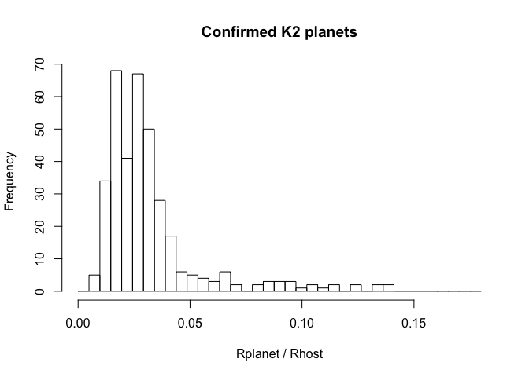
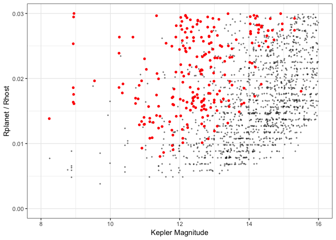

K2 planet yield estimate
================
J. Dotson
12/19/2018

Goal is to estimate the number of planets yet to be found in K2 data. As a rough starting point, let's look at how many planets were found in Kepler... But it's not a straight analogy based just on the number of targets. While both Kepler and K2 are executed with the same spacecraft, we need to make a few corrections to account for the differences between the missions.

Establish baseline from Kepler
------------------------------

First download the confirmed planets table and dr25 stars from NExScI.

``` r
download_flag <- TRUE  # Change to false if you want to use previously downloaded tables
#download_flag <- FALSE

if (download_flag)  {
  # download confirmed planets 
  baseurl<-"https://exoplanetarchive.ipac.caltech.edu/cgi-bin/nstedAPI/nph-nstedAPI?table=exoplanets"
  params<-"pl_hostname,pl_letter,pl_discmethod,pl_pnum,pl_orbper,pl_orbsmax,pl_orbeccen,pl_orbincl,pl_kepflag,pl_k2flag,ra_str,dec_str,ra,dec,st_dist,st_optmag,st_optband,gaia_gmag,st_teff,st_mass,st_rad,pl_cbflag,pl_eqt,pl_insol,pl_masse,pl_msinie,pl_rade,pl_radj,pl_trandep,pl_trandur,pl_imppar,pl_disc,pl_status,gaia_dist,st_spstr,st_logg,st_metfe,st_age,pl_facility"
  address<-paste(baseurl,"&select=",params,sep="")
  download.file(address, "data/confirmedplanets.csv")
  print(paste("Confirmed planets table downloaded on ",date()))
  
  
  # download DR25 stellar table
  baseurl<-"https://exoplanetarchive.ipac.caltech.edu/cgi-bin/nstedAPI/nph-nstedAPI?table=q1_q17_dr25_stellar"
  address<-paste(baseurl,"&select=*",sep="")
  download.file(address,"data/dr25stellar.csv")
  print(paste("DR25 stellar table downloaded on", date()))
}
```

\[1\] "Confirmed planets table downloaded on Wed Dec 19 17:13:20 2018" \[1\] "DR25 stellar table downloaded on Wed Dec 19 17:14:27 2018"

``` r
#read in the tables downloaded from NExScI
confirmedplanets <- read_csv("data/confirmedplanets.csv",comment = "#")

dr25stellar <- read_csv("data/dr25stellar.csv")
```

Next, let's filter the confirmed planets list from NExScI so that we have a list of planets that were observed by Kepler, discovered by transits, and have periods &lt;= 25 days. The period limit of 25 days is chosen since most K2 campaigns are ~ 80, this period cut off insures there are liklely at least 3 transits in one campaign.

``` r
kepler_planets<-filter(confirmedplanets, pl_facility == "Kepler")

maxperiod<-25

shortplanets<- filter(kepler_planets,pl_orbper <= maxperiod)
print(paste("Number of shorter period Kepler planets = ", nrow(shortplanets)))
```

\[1\] "Number of shorter period Kepler planets = 1712"

``` r
mytheme <- theme_bw()  #set overall look and feel of plots
```

The stars searched by Kepler and the found planet host stars plotted in Teff, log(g) space. Teal are all the stars observed by Kepler, grey are the host stars of long period planets and black are the host stars of short period planets.

``` r
plot_t_logg <- ggplot(dr25stellar) +
  geom_point(aes(x=teff,y=logg),col="cadetblue",alpha=0.1,size=0.4) + mytheme 
#plot(plot_t_logg + ggtitle("DR25 stars"))

plot_t_logg <- plot_t_logg + scale_x_reverse(limits=c(15000,0)) + scale_y_reverse()
#plot(plot_t_logg + ggtitle("DR25 stars"))

plot_t_logg <- plot_t_logg +
  geom_point(data=kepler_planets,aes(x=st_teff,y=st_logg),size=0.4,col="grey")
#plot(plot_t_logg2 + ggtitle("DR25 stars + confirmed planet hosts"))

plot_t_logg <- plot_t_logg + geom_point(data=shortplanets,aes(x=st_teff,y=st_logg),
                                          col="black",size=0.4) 
plot_t_logg <- plot_t_logg + labs(x = "Teff (K)", y = "log(g)")
print(plot_t_logg + ggtitle("DR25 stars + confirmed planet hosts + short period hosts"))
```


``` r
ggsave("plots/dr25stars.pdf")
```

Focus on Main Sequence stars
----------------------------

The bulk of the stars we find planets around are firmly on the main sequence. However, in both Kepler and K2 we observe earlier stars, giants and white dwarfs. Before moving on, let's do a couple of rough cuts inorder to target main sequence stars.

Apply the following cuts...

-   Teff &lt; 8500 K (mid-A)
-   logg &gt; 3.75

``` r
maxTeff <- 8500
minLogg <- 3.75

dr25MS <- filter(dr25stellar, teff < maxTeff)
dr25MS <- filter(dr25MS, logg > minLogg)
print(paste("Number of DR25 stars on the main sequence =", nrow(dr25MS)))
```

\[1\] "Number of DR25 stars on the main sequence = 168990"

``` r
# there are a few planets that aren't around MS stars, need to eliminate those
shortplanetsMS <- filter(shortplanets, st_teff < maxTeff)
shortplanetsMS <- filter(shortplanetsMS, st_logg > minLogg)
print(paste("Number of short period planets around MS =", nrow(shortplanetsMS)))
```

\[1\] "Number of short period planets around MS = 1658"

``` r
#define magnitude bins for subsequent analysis
binedges<-seq(from=4.5, to=21, by=0.5)
numbins<- length(binedges)-1
numedges<-length(binedges)

# bin the main sequence DR25 stars
dr25magfreqMS<-hist(dr25MS$kepmag,breaks=binedges,plot=TRUE,xlab="Kepler Magnitude",
                    main="DR25 Main Sequence Stars",ylab="Count")
```


``` r
keplermagfreqshortMS <- hist(shortplanetsMS$st_optmag,breaks=binedges,plot=TRUE,
                             xlab="Kepler Magnitude", ylab="Count",
                             main="Kepler Short Period planets around Main Sequence Stars")
```


Detectability
-------------

We need to take into account how detectable a planet is. Even in this shorter period regime, K2 is not going to be as sensitive because the shorter campaigns mean that we will observe fewer transits and have less data to build up sufficient S/N for detection of small transit signals. Let's use the ratio of planet radius to host star radius as an indicator of how detectable a planet is...

``` r
Rjup <- 69911 #km
Rsol <- 695700 #km

shortplanetsMS$Tdepth <- (shortplanetsMS$pl_radj * Rjup) / (shortplanetsMS$st_rad * Rsol)
```

We can compare the distribution of the ratio between Rplanet and Rstar between Kepler and K2 planet populations.

``` r
# identify the K2 planets in the confirmed planet list
k2planets<-filter(confirmedplanets, pl_facility=="K2")
print(paste("Number of k2 planets = ", nrow(k2planets)))
```

\[1\] "Number of k2 planets = 359"

``` r
k2planets$Tdepth <- (k2planets$pl_radj * Rjup) / (k2planets$st_rad * Rsol)
```

``` r
num_t_bins <-38
mybins <- seq(0,0.18,length.out=num_t_bins)


#SP_tdepth <- hist(shortplanets$Tdepth,breaks=mybins,plot=TRUE)
SPMS_tdepth <- hist(shortplanetsMS$Tdepth,breaks=mybins,plot=TRUE,xlab = "Rplanet / Rhost",
                    main = "Confirmed Kepler planets with MS hosts and period < 25 days")
```


``` r
K2_tdepth <- hist(k2planets$Tdepth,breaks=mybins,plot=TRUE,xlab = "Rplanet / Rhost",
                  main="Confirmed K2 planets")
```



As expected, even in short period regime, Kepler can see smaller planets than K2 has detected. So, let's apply another cut based on the planet / star size ratio. But where to put the cut?

Do we need to take magnitude into account when looking to account that smaller transits are less likely to be found in K2? Let's compare the phase space occupied by already discovered K2 planets with the Kepler planets. (Grey are Kepler planets, red are K2 planets.)

``` r
p_depth_mag <- ggplot(shortplanetsMS) + mytheme + ylab("Rplanet / Rhost") + xlab("Kepler Magnitude")
p_depth_mag <- p_depth_mag + geom_point(aes(x=st_optmag,y=Tdepth),size=0.4, alpha=0.4)
p_depth_mag <- p_depth_mag + geom_point(data=k2planets,aes(x=st_optmag,y=Tdepth), col="red",size=1.2)
print(p_depth_mag)
```


``` r
p_depth_mag <- p_depth_mag + ylim(c(0,0.03)) + xlim(c(8,16))
print(p_depth_mag)
```



As expected, there is a relationship between our proxy for transit signal S/N and stellar magnitude. Not surprisingly, Kepler can find smaller transits fainter than K2 can. Certainly a complicated relationship could be developed, but a straight line cut in transit depth / magnitude space is a plausible data-driven approach.

A line with slope = 0.0048 and intercept of -0.051 seems plausible.

``` r
myx <- seq(11.5,16,by=0.5)
my_slope <- 0.0048
my_intercept2 <- -0.051
myy2 <- my_slope * myx + my_intercept2

limitline <- data.frame(myx=myx,myy2=myy2)

p_depth_mag_wcut <- p_depth_mag + geom_line(data=limitline,aes(x=myx,y=myy2),col="blue",size=1) 
print(p_depth_mag_wcut)
```


``` r
ggsave("plots/depthmagcut.pdf")
```

Assuming all the Kepler planets above the blue line could plausibly be found by K2, that subpopulation as can be used as estimators in order to derive the fraction of stars in each magnitude bin that should have planets.

``` r
#identify kepler planets above the line
deepshortplanetMS <- filter(shortplanetsMS, Tdepth >= (my_slope*st_optmag + my_intercept2))

#sort the remaining planets into the bins
deepshortplanetmagfreqMS <- hist(deepshortplanetMS$st_optmag,breaks=binedges,plot=TRUE,
                                 xlab="Kepler Magnitude", ylab="Count",
                                 main="Kepler planets with deep transits")
```


The next step is to calculate the planet frequency in each magnitude bin. At this point, we are only including the planets that have main sequence hosts, have periods less than 25 days and whose transits are deep enough to be detectable by K2.

``` r
# start setting up a data frame to hold the frequency of Kepler planets
# initial contents are the Kepler DR25 stellar main sequence stars
keplerfrequency<-data.frame(mag_low=dr25magfreqMS$breaks[1:numbins],
                            mag_high=dr25magfreqMS$breaks[2:numedges],
                            mag_mid=dr25magfreqMS$mids,
                            num_stars=dr25magfreqMS$counts
                            )

# add a column with the counts of planets in each bin
keplerfrequency$num_deepshplanets <- deepshortplanetmagfreqMS$counts
# calculate frequency as the number of planets divided by the number of stars
keplerfrequency$freq_deepshplanets <- keplerfrequency$num_deepshplanets / keplerfrequency$num_stars
# add an error bar in the number of planets assuming poisson statistics
keplerfrequency$num_deepshplanets_err <- sqrt(keplerfrequency$num_deepshplanets)
# propogate error to the frequency
keplerfrequency$freq_deepshplanets_err <- keplerfrequency$num_deepshplanets_err / keplerfrequency$num_stars

# save planet frequency table for future use, just in case...
saveRDS(keplerfrequency,"RDS/keplerfrequency.RDS")

p_planetfrequency <- ggplot(keplerfrequency) + mytheme
p_planetfrequency <- p_planetfrequency + geom_pointrange(aes(x=mag_mid,y=freq_deepshplanets,
                                      ymin=freq_deepshplanets-freq_deepshplanets_err,
                                    ymax=freq_deepshplanets+freq_deepshplanets_err))
p_planetfrequency <- p_planetfrequency + ggtitle("Kepler MS + deep transits + period < 25 days") + ylab("Planet Frequency") + xlab("Kepler Magnitude")
print(p_planetfrequency)
```


``` r
ggsave("plots/planetfrequency.pdf")
```

Now, let's look at the targeted K2 stars Using a list of targets observed in at least one campaign between C1 and C17 with teff & logg values. List was retrieved from MAST and groomed in K2target\_planetestimate.Rmd.

``` r
K2targets <- readRDS("RDS/K2uniquestars.rds")  
```

``` r
print(paste("Number of K2 targets =", nrow(K2targets)))
```

\[1\] "Number of K2 targets = 287688"

Identify the subset of K2 targets which are main sequence stars, using the same criteria used to subset the Kepler stars. (Teff &lt; 8500 K and log(g) &gt; 3.75)

``` r
# filter to use MS stars only.
K2targets <- filter(K2targets, teff < maxTeff)
K2targets <- filter(K2targets, logg > minLogg)
print(paste("Number of main sequence K2 stars = ",nrow(K2targets)))
```

\[1\] "Number of main sequence K2 stars = 222258"

``` r
p1 <-  ggplot(dr25MS) + geom_density(aes(kepmag),col="cadetblue",
                                                   fill="cadetblue",alpha=0.3)
p1 <- p1 + geom_density(data=K2targets,aes(kp),fill="black",alpha=0.3)
p1 <- p1 + mytheme + xlab("Kepler Magnitude") + ylab("Probability Density")
print(p1)
```


``` r
ggsave("plots/star_mags.pdf")
```

The distribution in brightness is much broader for K2 than Kepler, so this method will only be so-so at bright and faint magnitudes.

Nonetheless, let's proceed... Sort the K2 observed stars into magnitude bins.


Predict the number of K2 planets by multiplying the number of K2 stars in each magnitude bin by the Kepler planet frequency in that bin.

``` r
#predict number of K2 planets by multiplying the number of K2 stars in each magnitude bin by the planet frequency in that bin estimated from Kepler
planetfreq$num_k2planets <- planetfreq$num_k2stars * planetfreq$freq_deepshplanets
planetfreq$num_k2planets_err <- planetfreq$num_k2stars * planetfreq$freq_deepshplanets_err

#Sum over all the bins to calculate the total number.
K2planet_prediction <- round(sum(planetfreq$num_k2planets,na.rm=TRUE))
print(paste("Predicted number of K2 planets = ",K2planet_prediction))
```

\[1\] "Predicted number of K2 planets = 1317"

``` r
K2planet_prediction_error <- round(sum(planetfreq$num_k2planets_err,na.rm=TRUE))
print(paste("plus or minus ",K2planet_prediction_error))
```

\[1\] "plus or minus 261"

``` r
p1 <- ggplot(planetfreq) + mytheme + labs(x="Kepler Magnitude", 
                                          y="predicted number of K2 planets")
p_prediction <- p1 + geom_pointrange(aes(x=mag_mid,y=num_k2planets,
                                             ymin=num_k2planets-num_k2planets_err,
                                             ymax=num_k2planets+num_k2planets_err))
#print(p_prediction)
```

``` r
# what's the distribution of known K2 planets?
k2planetfreq <- hist(k2planets$st_optmag,breaks=binedges,plot=FALSE)
temp_k2 <- data.frame(mids=k2planetfreq$mids, num=k2planetfreq$counts)
```

``` r
pcompare3 <- p1 + geom_bar(data=temp_k2,aes(x=mids,y=num),col="red",fill="red",stat="identity")
pcompare3 <- pcompare3 + geom_line(aes(x=mag_mid,y=num_k2planets))
#print(pcompare3)

pcompare3 <- pcompare3 + geom_ribbon(aes(x=mag_mid,ymax=num_k2planets + num_k2planets_err, ymin=num_k2planets - num_k2planets_err), col="grey",fill="grey") + geom_line(aes(x=mag_mid,y=num_k2planets))
pcompare3 <- pcompare3 + xlab("Kepler Magnitude") + ylab("Number of Planets") + xlim(c(7.5,20))
pcompare3 <- pcompare3 +
  annotate(geom="text",label="predicted",x=13.2,y=150,size=5,hjust="left")
pcompare3 <- pcompare3 + 
  annotate(geom="text",label="confirmed",x=13.2,y=45,color="red",size=5,hjust="left")
print(pcompare3 + ggtitle("Confirmed and Predicted Distribution of K2 planets"))
```


``` r
#print(pcompare3) #figure without title for publication
ggsave("plots/predict_and_known.pdf")
```
